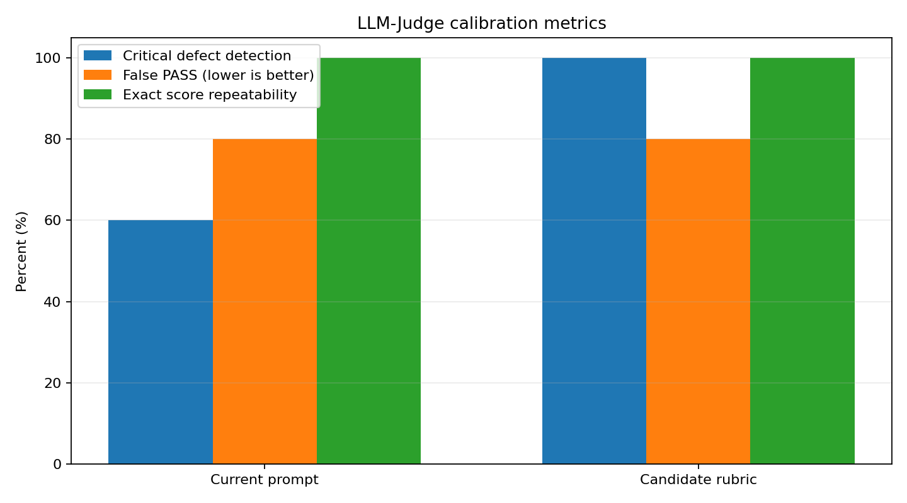

# Báo cáo thực nghiệm hiệu chỉnh LLM-Judge

> Trạng thái: **Bản nháp để nhóm hoàn thiện**. Các ô `_[Tự điền]_` được chừa lại cho phần diễn giải/báo cáo chính thức.

## 1. Mô tả kết quả thực nghiệm

- Judge cố định: `deepseek-v4-pro`.
- Hai notebook lịch sử: Groq và DeepSeek.
- Stability: 3 lần chấm/notebook/prompt.
- Sensitivity: 5 lỗi chủ đích (sai công thức, sai dataset, leakage, sai thứ tự, runtime).
- Frozen ResearchBundle: 12 concepts, RAG threshold 0.45.
- Số Judge run thành công: 22/22.
- Tổng chi phí Judge: $0.147500.
- Nhận xét tổng quan của nhóm: _[Tự điền]_.

## 2. So sánh giải pháp hiện tại với baseline

- Baseline: `prompts/verifier.txt` hiện tại.
- Giải pháp thử nghiệm: candidate rubric có score-cap, kiểm tra dataset/leakage và phân biệt TODO học viên.
- Kết luận lựa chọn: _[Tự điền sau khi xem bảng và raw feedback]_.

| Prompt | Critical defect detection ↑ | False PASS ↓ | Exact score repeatability ↑ | Unique feedback trung bình ↓ | Cost/run | Latency/run | Nhận xét |
|---|---:|---:|---:|---:|---:|---:|---|
| Baseline hiện tại | 60.0% | 80.0% | 100.0% | 2.50 | $0.006500 | 4.23s | _[Tự điền]_ |
| Candidate calibrated | 100.0% | 80.0% | 100.0% | 3.00 | $0.006900 | 3.98s | _[Tự điền]_ |

## 3. Stability trên hai notebook lịch sử

| Notebook | Prompt | Mean score | Std | Min-Max | Score tuple lặp y hệt? | Số feedback khác nhau | Nhận xét |
|---|---|---:|---:|---:|---|---:|---|
| groq | Baseline hiện tại | 4.25 | 0.0 | 4.25-4.25 | Có | 2 | _[Tự điền]_ |
| groq | Candidate calibrated | 4.25 | 0.0 | 4.25-4.25 | Có | 3 | _[Tự điền]_ |
| deepseek | Baseline hiện tại | 4.25 | 0.0 | 4.25-4.25 | Có | 3 | _[Tự điền]_ |
| deepseek | Candidate calibrated | 4.25 | 0.0 | 4.25-4.25 | Có | 3 | _[Tự điền]_ |

## 4. Sensitivity với lỗi chủ đích

| Case | Lỗi kỳ vọng tác động | Cap kỳ vọng | Baseline score / decision | Candidate score / decision | Phát hiện tốt hơn? | Giải thích |
|---|---|---:|---|---|---|---|
| `data_leakage` | groundedness | ≤3 | 4.0 / PASS | 2.0 / PASS | _[Tự điền]_ | _[Tự điền sau khi đọc feedback]_ |
| `runtime_error` | executability | ≤2 | 2.0 / RETRY | 2.0 / RETRY | _[Tự điền]_ | _[Tự điền sau khi đọc feedback]_ |
| `theory_after_use` | pedagogical_order | ≤3 | 3.0 / PASS | 3.0 / PASS | _[Tự điền]_ | _[Tự điền sau khi đọc feedback]_ |
| `wrong_dataset_claim` | groundedness | ≤2 | 4.0 / PASS | 2.0 / PASS | _[Tự điền]_ | _[Tự điền sau khi đọc feedback]_ |
| `wrong_sigmoid_formula` | groundedness | ≤2 | 2.0 / PASS | 2.0 / PASS | _[Tự điền]_ | _[Tự điền sau khi đọc feedback]_ |

## 5. Biểu đồ evaluation metrics

### Giải thích metrics

- **Critical defect detection rate:** tỷ lệ case mà tiêu chí bị hạ đến đúng score-cap đã định trước.
- **False PASS rate:** tỷ lệ notebook có lỗi chủ đích nhưng Verifier vẫn trả PASS; càng thấp càng tốt.
- **Exact score repeatability:** tỷ lệ notebook có cùng vector 4 điểm ở cả 3 lần chấm.
- **Unique feedback:** số feedback khác nhau khi chấm cùng notebook; thấp hơn thể hiện ổn định hơn, nhưng vẫn phải kiểm tra chất lượng nội dung.
- Ý nghĩa thực tế của chênh lệch: _[Tự điền]_.

## 6. Phân tích định tính

### Trường hợp Judge làm tốt

_[Tự điền ví dụ CELL/feedback]_.

### False positive / false negative

_[Tự điền]_.

### TODO dành cho học viên

_[Tự điền xem candidate đã giảm nhận xét sai về TODO chưa]_.

## 7. Kết luận và quyết định

- Prompt được chọn cho benchmark 20 case: _[Tự điền]_.
- Lý do: _[Tự điền]_.
- Hạn chế: calibration set nhỏ và lỗi được tạo chủ động; cần đối chiếu human annotation.
- Bước tiếp theo: _[Tự điền: sửa prompt / human rating / Cohen Kappa / benchmark]_.

### Hai nguyên nhân kỹ thuật đã xác định

1. `_research_summary()` hiện chỉ gửi topic, danh sách concepts và `source_id`; không gửi text của `theory_chunks` hoặc quote nguồn. Vì vậy Judge không có đủ evidence để thực sự kiểm tra claim có bám nội dung RAG hay không.
2. `decide()` chỉ kiểm tra execution, hard rules và điểm trung bình `>= 3.5`. Vì vậy notebook có Groundedness `2` vẫn PASS nếu ba điểm còn lại đủ cao. Candidate rubric đã hạ đúng điểm nhưng chưa thể chặn PASS nếu không sửa decision gate.

| Vấn đề | Bằng chứng | Thay đổi đề xuất | Trạng thái/Quyết định của nhóm |
|---|---|---|---|
| Judge thiếu text nguồn | Groundedness RAG/No-RAG khó phân biệt | Đưa theory chunk preview/quote vào research summary | _[Tự điền]_ |
| Điểm nghiêm trọng bị trung bình che khuất | Sai công thức và sai dataset vẫn PASS | Thêm minimum-score gate cho critical criteria | _[Tự điền]_ |
| Feedback chưa ổn định | Vector điểm giống nhau nhưng feedback khác nhau | Cache theo model+prompt+bundle+notebook hash | _[Tự điền]_ |
| TODO bị nhận xét như lỗi | Baseline yêu cầu hoàn thành bài tập dành cho học viên | Giữ TODO semantics trong candidate prompt và thêm test | _[Tự điền]_ |

## 8. Artifacts

- `raw_runs.json`: toàn bộ score, feedback, token, cost, hash và latency.
- `stability_summary.json`: thống kê 3 lần chấm.
- `sensitivity_summary.json`: kết quả theo lỗi chủ đích.
- `aggregate_metrics.json`: metrics tổng hợp baseline/candidate.
- `prompts/`: snapshot hai prompt đã dùng.
- `notebooks/`: calibration notebooks và executed outputs.
